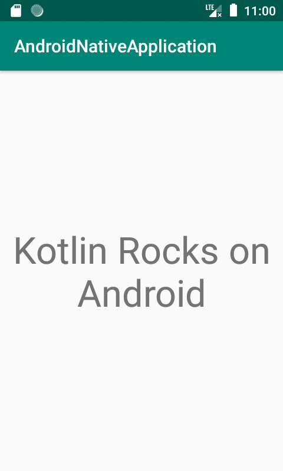

# Sample Kotlin Native project

This is just a the follow-along result of the tutorial you can find at [play.kotlinlang](https://play.kotlinlang.org/hands-on/Targeting%20iOS%20and%20Android%20with%20Kotlin%20Multiplatform/01_Introduction), to verify how much pain would take to setup the project and make it compile and run both on iOS and Android.

### Useful links

* [kotlin native overview](https://kotlinlang.org/docs/reference/native-overview.html)
* [kotlin native interoperability with Swift/Objective-C](https://kotlinlang.org/docs/reference/native/objc_interop.html)
* [Is Kotlin/Native production ready?](https://quickbirdstudios.com/blog/is-kotlin-native-production-ready/) It's a report by Quickbird Studios on what they tried to do with kotlin native and what they found out, as of March 2019.

### What's needed to run the project

You'll need Android Studio for the Android app and XCode for the iOS app.
Of course for iOS you'll need also a valid team account to compile and run the app.


## What's basically happening
The `SharedCode` folder contains, of course the code we want to share.
There's a `common.kt` file (inside `SharedCode > commonMain > kotlin` that defines what should be available to both platforms, and what is expected to be implemented with specific platform code:

```kotlin

package com.positec.kotlinnativeapplication

expect fun platformName(): String

fun createApplicationScreenMessage() : String {
    return "Kotlin Rocks on ${platformName()}"
}

```

So, `platformName()` is expected to be defined within the respective `androidMain` and `iosMain` folders, with a platform specific implementation.
Meanwhile, a `createApplicationScreenMessage()` method will be available both in the iOS and the Android projects.
Of course the two platform specific projects are using that method to customize a message.

The platform specific projects where created from scratch with Android Studio (using kotlin as language) and XCode (using swift as language).
The thing to watch out while creating the iOS project is that the bundle identifier must be the same as the Android applicationId.

First was created the android project, then, under a `native` folder inside the android project was created the XCode project.

The ios shared code framework has been imported manually as a framework, and a `Framework Search Path` was added, relative to the root folder:
`$(SRCROOT)/../../SharedCode/build/xcode-frameworks`


## What was not tested
Adding platform specific dependencies. 
While for gradle dependencies there should be no problems (still needs to be tested), Carthage [seems to be supported](https://github.com/JetBrains/kotlin-native/issues/1822), and [Cocoapods support is in beta](https://kotlinlang.org/docs/reference/native/cocoapods.html).
It would be nice to try adding a ios specific dependency and using it, for example  Alamofire. 
 


## Say I manage to run both projects, what should I see?

### on iOS emulator


### on Android emulator


## Quirks
If you try and launch the `packForXcode` gradle task, available from the `SharedCode` folder, the first thing you'll see in your console will be:

```bash
> Configure project :SharedCode
Kotlin Multiplatform Projects are an experimental feature.
```


